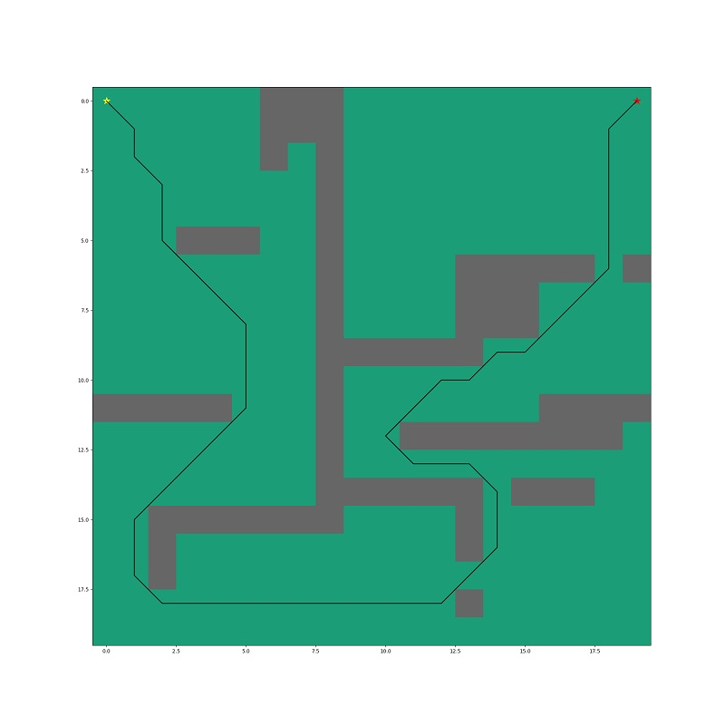

# A* Pathfinding Visualization

This Python script implements the A* (A-star) pathfinding algorithm to find the shortest path from a start point to a goal on a 2D grid with obstacles.

## Features
- Uses Euclidean distance as the heuristic for optimal pathfinding.
- Supports 8-directional movement (including diagonals).
- Visualizes the grid, obstacles, path, start (yellow star), and goal (red star) using Matplotlib.

## Grid Layout
- **0**: Free space (navigable).
- **1**: Obstacle (blocked).
- Dimensions: 20x20 cells.
- Start: (0, 0) - top-left.
- Goal: (0, 19) - top-right.

## Requirements
```bash
pip install numpy matplotlib
```

## Usage
1. Run the script: `python a_star.py`
2. Outputs the path coordinates to console.
3. Displays an interactive plot showing:
   - Gray/black obstacles.
   - Black line tracing the optimal path.
   - Yellow star at start, red star at goal.

## Algorithm Details
```
A* uses f(n) = g(n) + h(n):
- g(n): Exact cost from start to current node
- h(n): Heuristic estimate to goal (Euclidean distance)
- Priority queue (heapq) ensures lowest f-score expanded first
```

## Path Output Example
```
[(0, 0), (0, 1), (0, 2), ..., (0, 19)]
```
The path navigates around obstacles while minimizing total distance.

## Customization
- Modify `grid` array to change obstacles.
- Update `start` and `goal` tuples.
- Swap `heuristic` for Manhattan distance: `abs(b[0]-a[0]) + abs(b[1]-a[1])`.

## Example Output
The visualization shows a smooth path hugging the top edge, avoiding obstacle clusters in columns 6-9 and the bottom-right area.




***
